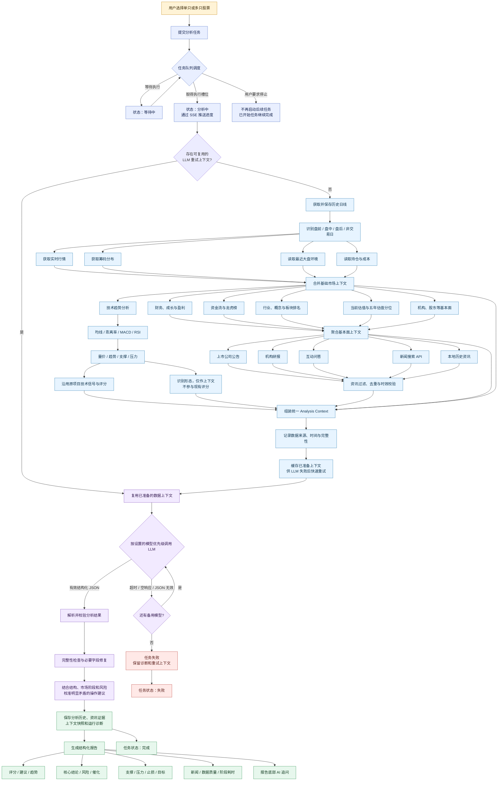
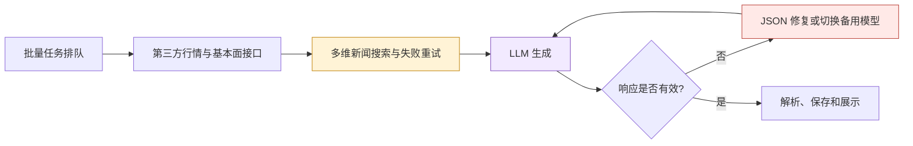

# StockMaster 股票分析流程

本文描述 StockMaster 当前的实际股票分析链路。批量分析与单股分析复用同一条分析管线，区别仅在于批量任务增加了排队、并发控制和停止补充后续任务的逻辑。

## 关键规则

- 单股和批量分析共用同一套数据获取、技术指标、新闻分析、LLM 分析和评分逻辑。
- 基本面和资讯中的独立数据源尽可能并行获取；任务队列与 LLM 调用仍设置并发上限，避免触发限流。
- 单一数据源失败时按原有 fallback 链路降级；链路全部耗尽时记录缺失及原因，不把“无数据”解释成“无风险”。
- LLM 调用失败后优先复用已经准备好的数据上下文，只重新执行模型生成、结果校验和报告保存。
- 新增的估值分位、形态识别和市场温度只用于提供分析背景，不参与原有评分和买卖判断计算。
- 底层保留“买入 / 观望 / 卖出”结论；界面根据持仓状态映射为“加仓 / 持仓 / 减仓 / 清仓”或“建仓 / 观察 / 忽略”。

## 主要进度阶段

| 进度 | 阶段 | 主要工作 |
| ---: | --- | --- |
| 12% | 准备任务 | 初始化单股分析和重试上下文 |
| 16% | 行情就绪 | 历史日线获取并保存完成 |
| 18% | 实时与筹码 | 获取实时行情、筹码和市场阶段 |
| 32% | 基本面与趋势 | 聚合基本面并计算技术趋势 |
| 46% | 资讯检索 | 获取公告、研报、互动问答和新闻 |
| 58% | 上下文整理 | 汇总技术、基本面、资讯和持仓信息 |
| 64%–68% | 模型生成 | 调用主模型或按顺序切换备用模型 |
| 94% | 结果校验 | 解析 JSON、检查完整性和校准建议 |
| 97% | 保存结果 | 写入报告、上下文快照和诊断数据 |
| 100% | 分析完成 | 前端展示结构化报告 |

## 主要耗时位置

通常最不稳定、耗时波动最大的部分是新闻网络请求和 LLM 生成；日线技术指标计算本身通常较快。

## 性能与失败恢复护栏

- 模型链路只有一层显式 fallback：每个模型只进行一次传输调用，参数不兼容时仍允许一次去除不受支持参数的兼容重试；不会再叠加 LiteLLM Router 的隐式重试。
- 普通、Flash 和 Claude/Sonnet 高质量备用模型分别使用独立超时预算；同一模型连续失败后短期熔断，成功且响应稳定时逐步恢复允许的并发。
- 已准备输入会在调用 LLM 前写入本机检查点。桌面后台重启后，任务日志恢复的未完成股票可以直接重用相同输入，只重跑模型生成、结果校验和保存阶段。
- 运行流同时记录数据源尝试、每个模型尝试、结果校验耗时及评分轨迹。评分轨迹只解释“模型原始值 → 结构约束 → 市场阶段 → 大盘约束 → 最终动作”，不会再次改分。
- 首页大盘快照使用短时缓存和并发请求合并；批量个股分析期间暂停自动大盘刷新，避免与分析取数争抢免费源。

可在设置页调整以下稳定性参数：

| 参数 | 默认值 | 含义 |
| --- | ---: | --- |
| `LITELLM_ANALYSIS_TIMEOUT_SECONDS` | 90 | 普通分析模型单次预算 |
| `LITELLM_FAST_MODEL_TIMEOUT_SECONDS` | 60 | Flash 快速模型单次预算 |
| `LITELLM_QUALITY_FALLBACK_TIMEOUT_SECONDS` | 120 | Claude/Sonnet 最终备用单次预算 |
| `LITELLM_CIRCUIT_FAILURE_THRESHOLD` | 2 | 连续失败熔断阈值 |
| `LITELLM_CIRCUIT_COOLDOWN_SECONDS` | 180 | 熔断冷却时间 |
